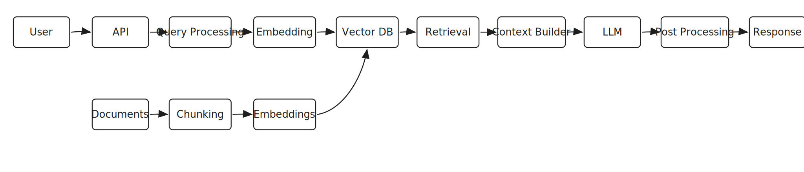

# Local RAG Chatbot Over a Paul Graham Essay

This project is a simple, fully local Retrieval-Augmented Generation (RAG)
chatbot built with LlamaIndex. It indexes a Paul Graham essay, retrieves the
most relevant text chunks for a user question, and uses a local Ollama Llama 3
model to generate an answer grounded in the retrieved context.

The goal of this project is correctness, simplicity, and understanding the
end-to-end RAG pipeline without relying on paid APIs.

## What This Project Does

The system follows a standard RAG flow:

1. **Ingestion**
   - Scrapes a Paul Graham essay from the web.
   - Extracts the HTML body text using BeautifulSoup.
   - Cleans extra whitespace.
   - Saves the cleaned text locally in `data/essay.txt` for debugging and
     inspection.

2. **Indexing**
   - Loads the local text file using LlamaIndex.
   - Splits the text into chunks.
   - Converts each chunk into an embedding using a local HuggingFace embedding
     model.
   - Builds a vector index from those embeddings.

3. **Storage**
   - Persists the index locally in the `storage/` directory.
   - This avoids rebuilding the index every time the chatbot is queried.

4. **Querying**
   - Loads the persisted vector index.
   - Embeds the user query with the same embedding model used during indexing.
   - Retrieves the most relevant chunks from the index.
   - Sends the retrieved context and user question to a local Ollama Llama 3
     model.
   - Uses a constrained prompt that asks the model to answer only from the
     provided context.

## Architecture



Editable source: [`architecture.excalidraw`](architecture.excalidraw)

```text
Paul Graham essay URL
        |
        v
HTML scraping + cleaning
        |
        v
data/essay.txt
        |
        v
Chunking with LlamaIndex
        |
        v
Local HuggingFace embeddings
        |
        v
Persisted local vector index
        |
        v
User query -> retrieval -> context -> Ollama Llama 3 -> answer
```

## Tech Stack

- **Python**
- **LlamaIndex** for document loading, chunking, indexing, and retrieval
- **BeautifulSoup** for HTML parsing
- **HuggingFace sentence-transformers** for local embeddings
- **Ollama** for running the local Llama 3 language model
- **Local persisted storage** for the vector index

## Current Configuration

The main configuration lives in `app/config.py`.

```python
embedding_model = "sentence-transformers/all-MiniLM-L6-v2"
llm_model = "llama3"
chunk_size = 1024
chunk_overlap = 200
data_dir = "data"
storage_dir = "storage"
```

These values can be overridden with environment variables:

```text
RAG_DATA_DIR
RAG_STORAGE_DIR
RAG_EMBEDDING_MODEL
RAG_LLM_MODEL
RAG_CHUNK_SIZE
RAG_CHUNK_OVERLAP
```

## Why These Choices

### Local Embeddings

This project uses `sentence-transformers/all-MiniLM-L6-v2` because it is small,
fast, and can run locally. This keeps the project free from paid API
dependencies while still providing semantic search capability.

### Chunking With Overlap

The text is split into chunks with overlap so that important information is not
lost at chunk boundaries. If chunks are too small, the retriever may return text
fragments without enough context. If chunks are too large, retrieval can become
noisy because each chunk may contain unrelated information.

### Local Vector Storage

For this prototype, LlamaIndex local persistence is enough. It keeps the system
simple and makes it easy to inspect and rerun locally. In a production system,
a dedicated vector database such as Qdrant, pgvector, Weaviate, or Milvus may be
more appropriate.

### Local LLM

The project uses Ollama with Llama 3 so that generation also runs locally. This
avoids paid APIs and keeps the system private, but the tradeoff is that response
quality and latency depend on the local machine.

## How To Run

### 1. Install dependencies

```bash
pip install -r requirements.txt
```

### 2. Make sure Ollama is running

Install Ollama and pull the Llama 3 model:

```bash
ollama pull llama3
```

### 3. Ingest the essay

```bash
python -m app.ingest
```

This creates:

```text
data/essay.txt
```

### 4. Build the index

```bash
python -m app.indexer
```

This creates or updates the local persisted index in:

```text
storage/
```

### 5. Query the chatbot

```bash
python -m app.query
```

Then ask questions in the terminal.

## Prompting Strategy

The query step uses a constrained prompt:

```text
You are answering based ONLY on the provided context.
Do not add extra information.

Context:
{context_str}

Question:
{query_str}

Answer:
```

This helps reduce hallucination by instructing the model to use only retrieved
context. However, prompting alone does not fully prevent hallucination. The
quality of the retrieved chunks is still the most important factor.

## Limitations

This is a learning-focused prototype, not a production-grade RAG system.

Current limitations:

- It indexes only one essay.
- HTML cleaning is basic and extracts the full `<body>` text.
- There is no explicit retrieval evaluation dataset.
- The system does not currently show citations or source chunks with answers.
- The query engine uses LlamaIndex retrieval defaults unless configured further.
- The prompt reduces hallucination risk but does not guarantee grounded answers.
- Local LLM performance depends on the machine running Ollama.

## Production Improvements

If this were moved toward production, the next improvements would be:

- Improve HTML cleaning to remove navigation, boilerplate, and unrelated text.
- Store metadata such as source URL, title, and section information.
- Set and tune `similarity_top_k` explicitly.
- Return citations or source snippets with each answer.
- Add a refusal behavior for questions that cannot be answered from context.
- Evaluate retrieval quality with a small set of known questions and expected
  source chunks.
- Use a production vector database for larger document collections.
- Add logging for user queries, retrieved chunks, latency, and model responses.
- Version the index so changes to chunking or embedding models are traceable.
